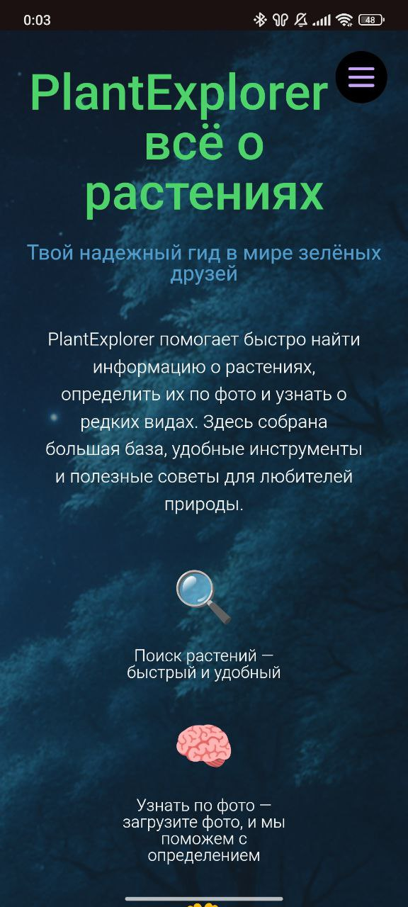

# PlantExplorer

**PlantExplorer** — это интерактивное веб-приложение, позволяющее пользователям исследовать, определять и отслеживать растения по всему миру. Проект создан с использованием современных технологий, API и картографических инструментов для демонстрации навыков фронтенд и бэкенд-разработки.

## 🚀 Демо

Приложение доступно по ссылке: [PlantExplorer](https://AleksandrRDK.github.io/plant-explorer)

## 📸 Скриншоты

### Десктопная версия


### Мобильная версия



## 📚 Возможности

-   **Поиск растений**:

    -   Поиск по названию с краткой информацией.
    -   Интерактивный список с карточками растений и модальными окнами.

-   **Определение по фотографии**:

    -   Загрузка фото и определение растения с помощью PlantNet API.
    -   Подсказки и вероятность совпадения.
    -   Обработка ошибок (включая `ERR_NAME_NOT_RESOLVED`, рекомендации по VPN/браузеру).

-   **Карта наблюдений**:

    -   Карта с фильтрами по региону и виду.
    -   Кастомные маркеры и просмотр изображений в модальном окне.
    -   Индикация загрузки и пустых результатов.

## 🛠 Используемые технологии

### Основной стек:

-   **React + Vite** — быстрая разработка современного SPA.
-   **TypeScript** — типизация и надежность.
-   **Sass** — стилизация с использованием CSS-переменных.
-   **React Router** — маршрутизация по страницам.
-   **Axios** — API-запросы.
-   **Docker** — контейнеризация приложения.

### Вспомогательные библиотеки:

-   **React Leaflet** — отображение карты с кастомными маркерами.
-   **gh-pages** — деплой на GitHub Pages.

### Используемые API:

-   **Perenual Plant API** — для получения информации о растениях.
-   **PlantNet API** — для определения растений по фотографии.
-   **iNaturalist API** — для получения данных наблюдений за растениями.

## 🔧 Установка и запуск

1. Клонируйте репозиторий:
    ```bash
    git clone https://github.com/AleksandrRDK/plant-explorer.git
    ```
2. Перейдите в корневую папку проекта:
    ```bash
    cd plant-explorer
    ```
3. Запустите проект с помощью Docker Compose:
    ```bash
    docker compose up --build
    ```
4. Для последующих запусков:
    ```bash
    docker compose up -d
    ```
5. Откройте в браузере: [http://localhost:5173](http://localhost:5173)

## 📝 Планы по развитию

-   пока что не предусмотрены

## 🤝 Вклад в проект

Если вы хотите внести свой вклад, выполните следующие шаги:

1. **Сделайте форк репозитория** — создайте копию репозитория в вашем аккаунте.
2. **Создайте новую ветку** (`git checkout -b feature/new-feature`).
3. **Закоммитьте изменения** (`git commit -m 'Add new feature'`).
4. **Запушьте изменения** (`git push origin feature/new-feature`).
5. **Создайте Pull Request** в оригинальный репозиторий.

## Контакты

Для связи: [aleksandrrdk.code@gmail.com]
